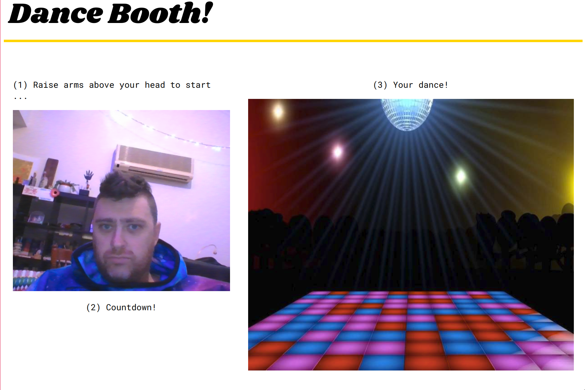

# The Dance Booth! 

### Setup

Clone it and jump into the root dir:

```
git clone https://github.com/silverpond/dance-booth.git
cd dance-booth
```

Set up the UI

```
cd ui && yarn install && cd -
```

Build the server (install [stack](https://docs.haskellstack.org/en/stable/README/) first,
if you don't have it yet)

```
cd server && stack build && cd -
```

### Running

```
./serve
```

Then, navigate to [localhost:8000](http://localhost:8000)!

Once it's loaded, you should see something like this:



Follow the instructions! After dancing for 10 seconds, you should see two
videos in the `./saved-videos` folder!
